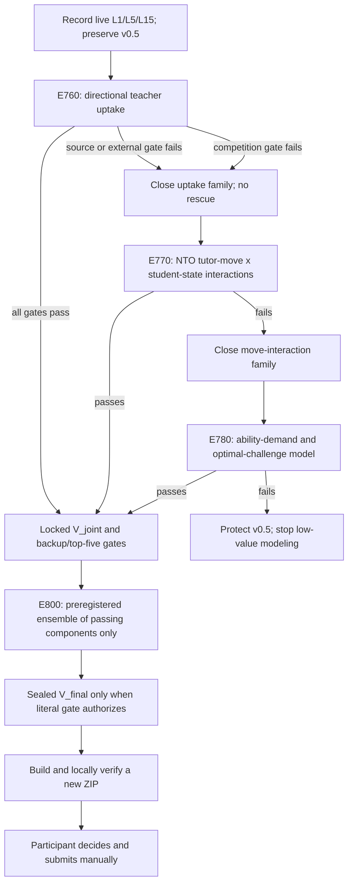

# Trace the Ace: evidence-based first-place action plan

**Plan date:** 2026-07-28 (Asia/Kolkata)
**Branch at audit:** `codex/v04-recovery`
**Verified starting HEAD:** `878245f182e6403b81ba57181098d315ca2d99eb`
**Public champion:** v0.5, log loss `0.6054`, last observed approximately `#11`
**Protected ZIP:** `submission_builds/final_ensemble_v05_bge_backup.zip`
**Protected ZIP SHA-256:** `65467003547fb62ec867733c6acf0a63e6f9fb0fed9533b61b9592e143b17186`
**Submission boundary:** Codex must never upload or submit. The participant makes every platform action manually.

## 1. Executive conclusion

First place cannot be promised. The evidence does, however, support a disciplined route with several independent
attempts.

The remaining gap is not likely to be closed by another encoder, longer context, generic nonlinear head,
calibration sweep, objective prior, session aggregation, or unrelated external corpus. Those axes have been tested
repeatedly and failed under the frozen environments.

The strongest remaining hypothesis is that v0.5 captures **what the lesson is about**, but not enough of **how the
tutor adapts to the student and how the student responds**. Recent primary research provides three untried,
mechanistically distinct ways to represent that missing process:

1. teacher uptake of a student's immediately preceding contribution;
2. tutor-move by student-mastery interactions;
3. challenge/difficulty alignment separated from student ability.

The plan is therefore a gated portfolio. Each family gets one frozen implementation and one authorized competition
selection validation only after it passes source, target-free, resource, and focused-test gates. A failure closes
that exact family and moves to the next independent family. Only components that pass alone may enter a final
ensemble.

## 2. The score target must be live, not remembered

The public leaderboard is sign-in gated. The only browser context available during this audit was not signed in, so
the current first-place score could not be verified. The last locally recorded leader was `0.6013` on 2026-07-17,
but that number may be stale.

Before deciding to spend a manual submission, record from the signed-in leaderboard:

- current first-place log loss, `L1`;
- current fifth-place log loss, `L5`;
- current fifteenth-place log loss, `L15`;
- v0.5's exact rank;
- the timestamp.

Use:

```text
first-place safety target = L1 - 0.0003
public gain needed = 0.6054 - first-place safety target
```

If `L1` were still `0.6013`, the safety target would be `0.6010` and the public gain needed would be `0.0044`.
That is too large to expect from one small feature. It likely requires two genuinely complementary process signals,
or one unusually strong process model, followed by conservative ensembling.

| Tier | Evidence target |
|---|---|
| Preserve top 15 | Keep v0.5 byte-for-byte; submit nothing weaker |
| Conservative top five | Projected public loss `<=0.6038` and at least `0.0016` robust gain over v0.5 |
| First-place attempt | Projected public loss below live `L1` with a `0.0003` safety margin and full locked confirmation |
| Overall competition win | Strong leaderboard result plus a rigorous, relevant, generalizable write-up |

## 3. What the full learning log says

### 3.1 What worked

1. Full-session word TF-IDF/logistic regression produced the first real transcript gain.
2. v0.2's fixed word/role/BGE-small ensemble moved the public score from `0.6181` to `0.6081`.
3. Ordered tutor-feedback word windows were the only consistently useful tutoring-process family. The effect was
   small, about `0.0010` mean loss gain, but it was complementary and directionally stable.
4. Replacing BGE-small with raw BGE-base produced the strongest robust component improvement:
   approximately `0.001272` mean hardened loss gain, with every environment improving.
5. That replacement became public v0.5 and improved the public score to `0.6054`.
6. E560's residual head improved loss, Brier, and ECE by about `0.0010`, but harmed AUROC.
7. E570's pairwise objective ranker improved AUROC by about `0.0032`, but added little loss gain and harmed ECE.
8. E740's session-mastery head improved loss by `0.000616` and improved calibration, but harmed AUROC and was
   unstable.

These near-wins matter: useful information exists in feedback adjacency, nonlinear residual structure, objective
ranking, and session mastery. The failure is not absence of signal; it is failure to capture one signal that improves
ranking and calibration across provider/objective shifts at the same time.

### 3.2 What failed and should remain closed

- Post-hoc v0.4 formula selection and partial-fold validation failed publicly.
- Pooled stacking, Platt scaling, beta calibration, tiny weight optimization, and prior shrinkage were unstable.
- Larger or different encoders, longer context, pooling changes, multi-view BGE, multi-instance attention, Qwen,
  ModernBERT, MPNet, and BGE-large did not solve the missing signal.
- Timing, style gates, session weighting, bagging, character hashes, sparse objective conjunctions, semantic
  alignment transforms, objective priors, retrieval, NLI, and generic tree heads failed.
- E580-E700 external correctness, quality, simulation, remediation, and dialogue-state transfers did not translate
  reliably to competition loss even when an external benchmark was strong.
- E710-E750 are closed literally. In particular:
  - E710 learned tutor-to-next-student coherence; it improved AUROC but regressed loss and calibration.
  - E720 sparse objective/role conjunctions regressed badly.
  - E730 objective/context Procrustes alignment improved ECE only.
  - E740 session mastery was too small and unstable.
  - E750 session-conditional objective likelihood regressed every environment.

No later experiment may use a failed branch's prediction, checkpoint, cache, weight, or score as a rescue ingredient.

### 3.3 What has genuinely not been tried

Repository and log searches found no implementation of:

- directional **student-to-next-tutor uptake**;
- chance-corrected tutor versus student lexical adaptation;
- the 2026 National Tutoring Observatory tutor-move taxonomy;
- explicit interactions such as `press for reasoning x high mastery` and `revoicing x low mastery`;
- a three-state under-challenged / optimally challenged / over-challenged trajectory;
- a Rasch/IRT-style separation of transcript-grounded student ability and current task demand.

These are concepts mentioned broadly in the original implementation plan, but they have not been built or scored.

## 4. Why these remaining hypotheses are credible

The official competition description says strong solutions should use the transcript, asks which tutor actions and
moments predict learning, and warns that objective difficulty alone is not an interesting contribution:

- [Trace the Ace problem description](https://platform.k12-ai-infrastructure.org/competitions/3/tutoring-outcomes/page/4/)
- [Trace the Ace provider and dataset background](https://platform.k12-ai-infrastructure.org/competitions/3/tutoring-outcomes/page/5/)

The training data combines different label-generating processes. Eedi sessions are short typed chats where the
outcome is the next question attempted. TSL sessions are long ASR lessons where the outcome is a conceptual review
aligned to one or more objectives. This explains why ordinary random/session validation and pooled calibration were
optimistic and why `V_objective` and `V_style` must remain mandatory.

Primary research supports the proposed sequence:

- The National Tutoring Observatory's own 2026 taxonomy organizes tutoring into moves such as prompting
  self-explanation, prompting self-correction, revoicing, hints, conceptual/procedural explanation, and direct
  answer-giving. It is expressly designed to connect multi-provider tutoring behavior to learning outcomes:
  [NTO Tutor Move Taxonomy](https://arxiv.org/abs/2603.05778).
- Conversational uptake research defines whether a teacher builds on the student's immediately preceding
  contribution and finds that an unsupervised uptake score generalizes across three educational datasets:
  [Measuring Conversational Uptake](https://aclanthology.org/2021.acl-long.130/).
- A 2025 study of 52,800 tutoring transcripts finds tutor lexical alignment positively predicts achievement growth
  while student lexical alignment predicts it negatively; generic semantic and syntactic alignment do not:
  [Linguistic Alignment Predicts Learning](https://aclanthology.org/2025.findings-emnlp.844/).
- A tutoring study reports AUC `0.63` from tutor moves, `0.66` from student mastery, and `0.77` when they interact.
  Pressing for reasoning is associated with high-mastery success, while revoicing is useful for lower-mastery
  students: [Tutor discourse and mastery interaction](https://arxiv.org/abs/2405.06218).
- A 2026 challenge-alignment study classifies turn sequences as under-, optimally, or over-challenging from attempts,
  errors, confusion, and scaffolding, and finds that those trajectories predict subsequent success:
  [Measuring Optimal Challenge](https://aclanthology.org/2026.bea-1.46/).
- A separate 2026 model improves dialogue knowledge tracing by separating student ability and task difficulty using
  an IRT/Rasch structure:
  [Difficulty-Aware Dialogue KT](https://aclanthology.org/2026.bea-1.43/).
- Whole-dialogue averages can hide answer extraction and scaffolding resistance; turn-level analysis exposes them:
  [Pedagogical alignment in student-AI dialogue](https://aclanthology.org/2026.acl-long.875/).

## 5. The execution portfolio



### E760 — directional teacher uptake

**Scientific question:** Does the degree to which a tutor builds on the student's immediately preceding contribution
provide a robust session/process signal beyond v0.5 semantics?

**Why it is independent:** E710 modeled `tutor -> next student` coherence with competition-self-supervision. E760
models the reverse pedagogical direction, `student -> next tutor`, using explicit uptake supervision and
chance-corrected directional lexical controls. It does not use E710's cache, model, score, or predictions.

**Prize-safe source policy:**

- The `ddemszky/conversational-uptake` GitHub repository exposes 2,246 expert-labeled K–12 math
  student-to-teacher exchanges and identifies the repository as MIT licensed:
  [conversational-uptake repository](https://github.com/ddemszky/conversational-uptake).
- The authors' Hugging Face uptake checkpoint is labeled `CC-BY-NC-ND-4.0`; it is not commercially safe and must
  not be downloaded, trained from, packaged, or used.
- Before modeling, freeze the exact Git commit, license file, source URL, file hashes, row counts, transcript-group
  field, and label distributions. If the dataset file is not unambiguously covered by the MIT grant, stop and seek
  written organizer clearance.

**Pre-outcome work:**

1. Build a canonical immutable external cache.
2. Group all external folds by source transcript/observation ID.
3. Compare only preregistered self-contained sparse pair representations against repetition overlap, using external
   labels only.
4. Require a material grouped-CV improvement over the repetition baseline, stable direction in at least four folds,
   and usable ordinal agreement/correlation before any competition outcome access.
5. On competition transcripts, create target-free student-to-next-tutor pair scores and deterministic within-session
   shuffled controls.
6. Aggregate only frozen features: all-session uptake, objective-relevant uptake, early/late change, high-uptake
   fraction, and chance-corrected tutor-minus-student directional alignment.
7. Run focused parser, leakage, permutation, session-invariance, and sample-independence tests.
8. Benchmark the exact full build. If projected runtime exceeds one hour, do not launch until a harmless scheduler
   wake has fired end-to-end in the same session.
9. Commit and push the frozen implementation and preregistration before the first competition score.

**Competition gate:** exactly one `V_seen`/`V_objective`/`V_style` selection validation, fixed fold-local linear
component, fixed seed, and only preregistered `10%/20%/30%` blends over raw v0.5. Require:

- at least `0.0016` equal-environment mean loss gain;
- all three environments improve;
- no fold regression over `0.0005`;
- macro AUROC, Brier, and ECE do not regress;
- at least `95%` positive-gain support in both session and semantic-family bootstraps.

Any failure closes the complete uptake family without a smaller weight, different n-gram, classifier, calibration,
aggregation, or E710 combination.

### E770 — NTO tutor-move by student-state interactions

**Scientific question:** Is the same tutor move beneficial or harmful depending on the student's state immediately
before it?

**Why it is independent:** This is not E220's generic answer-feedback vocabulary, E530's failed MathDial move
classifier, or a generic tree. It uses a new NTO-aligned, competition-only process representation and explicitly
predefined move-by-state interactions. No E220/E530 artifact or prediction enters.

**Frozen candidate design to prepare:**

- Tutor moves: probing prior knowledge/understanding, prompting self-explanation, prompting self-correction,
  prompting next step, correct/incorrect feedback, revoicing/restating, hinting, example-giving,
  conceptual/procedural explanation, direct answer, process praise, and outcome praise.
- Student states: substantive attempt, short guess, uncertainty, expressed reasoning, self-correction, answer
  change, objective/math-token evidence, scaffolding acceptance, resistance, and bypass.
- Interactions: press-for-reasoning after strong mastery evidence; revoicing after weak mastery evidence;
  self-correction prompt after an error; direct answer followed by low student activity; hint followed by a new
  attempt; and process praise followed by elaboration.
- Dynamics: early/middle/late rates and transitions, but no generic trajectory hash or learned attention.
- Estimator: a small regularized linear head over predefined continuous interactions. Do not use a generic tree
  search or feature-importance-driven rescue.

**Target-free gate:** a fixed synthetic dialogue suite must distinguish every move/state and its negation, remain
stable to harmless paraphrases and ASR-like noise, and show no response-label access. Parser coverage must be
reported by `V_style` proxy without reading outcomes. Freeze every rule, prototype, aggregation, interaction, seed,
estimator, weight, and gate before scoring.

**Outcome gate:** the same literal E760 proper-score, fold, environment, and bootstrap rules. Failure closes the
family without adding/removing moves after the result.

### E780 — ability-demand and optimal-challenge model

**Scientific question:** Can we distinguish a student's demonstrated ability from the difficulty/demand of the
current tutor task, then summarize whether the session is under-, optimally, or over-challenging?

**Novelty shield before authorization:**

- Prove by code/log search that the exact estimator is not E221 event-sequence rescue, E570 pairwise objective
  ranking, E740 session-mean mastery, or E750 session-conditional likelihood.
- Use no failed checkpoint, probability, or target-derived cache.
- The Difficulty-Aware-DialogKT repository currently contains only a placeholder README, one commit, and no
  usable license/code/data. It is research inspiration only, not an authorized external asset:
  [current repository state](https://github.com/umass-ml4ed/Difficulty-Aware-DialogKT).

**Candidate structure:**

1. Segment local task episodes from tutor prompts and following student attempts.
2. Estimate transcript-grounded ability evidence from attempts, explanations, uncertainty, error, and recovery.
3. Estimate demand from the objective plus the tutor's actual posed task, never from objective ID/frequency alone.
4. Map episodes into fixed under-/optimal-/over-challenge states.
5. Use an identifiable Rasch-like scalar structure, not an unconstrained concatenated dense head.
6. Aggregate state proportions and direction of capability change.

The target-free benchmark must recover known synthetic ability and difficulty orderings and remain invariant to
session duplication and response ordering. Then apply the same frozen one-validation rule and literal gates.

### E800 — final ensemble, only if something passes

E800 is not a place to rescue failures.

- Eligible parents must each pass their own robust gate.
- Freeze rounded nonnegative weights before `V_joint`.
- Evaluate only a short preregistered list, ideally v0.5 plus one or two passed process components.
- Default to no additional calibration because prior Platt/beta/global calibration experiments were harmful.
- A calibration transform is eligible only if preregistered from development OOF diagnostics, global,
  cross-fitted, and stable in every environment; it cannot be a public-score reaction.
- Open `V_joint` once for the locked candidate. Open the sealed `V_final` only when the existing literal top-five
  gate authorizes it.
- Build a new ZIP only after the backup gate passes. Keep v0.5 untouched.

## 6. Exact failure policy

| Failure point | Required response |
|---|---|
| Source/license ambiguity | Stop that external branch; do not infer permission |
| Target-free or synthetic gate fails | Reject before outcome scoring; move to next family |
| Resource gate fails | Reject exact design or redesign only before outcome access as a new preregistration |
| Selection loss gain below `0.0016` | Reject exact family; no rescue |
| Any environment regresses | Reject exact family |
| AUROC, Brier, or ECE regresses | Reject exact family |
| Fold bound or bootstrap fails | Reject exact family |
| `V_joint` reverses | Reject candidate; do not reopen development weights |
| `V_final` reverses | Do not package or recommend submission |
| No family passes | Preserve v0.5 and invest remaining time in the write-up |

## 7. Submission-budget policy

Two manual submissions remain in the current week.

1. Use zero submissions for failed or near-tie candidates.
2. First slot: only a candidate that passes the conservative top-five gate and local ZIP verification.
3. Second slot: reserve for a genuinely independent, stronger locked candidate—not a weight or calibration tweak.
4. Reconfirm the platform's remaining quota at the start of each competition week; do not assume a reset.
5. A public result answers one preregistered scientific question. It does not authorize tuning to the board.
6. Codex prepares and verifies ZIPs locally only. The participant chooses and performs every submission.

## 8. Thirty-day schedule

### 2026-07-28 to 2026-08-03 — uptake family

- Record live leaderboard targets manually.
- Audit and freeze the MIT uptake source.
- Implement tests and the external grouped benchmark.
- If gates pass, freeze/push E760 and run exactly one competition selection validation.
- If E760 passes, complete locked confirmation and ZIP gates; otherwise close it immediately.
- Start the write-up evidence table and diagrams now.

### 2026-08-04 to 2026-08-10 — tutor-move interactions

- Build the target-free NTO taxonomy parser and synthetic suite.
- Freeze/push E770 only if coverage and invariance pass.
- Run one selection validation.
- Preserve all ablations and failure evidence for the write-up.

### 2026-08-11 to 2026-08-17 — ability/difficulty

- Complete the E780 novelty audit.
- Implement the smallest identifiable challenge/ability model.
- Run only if synthetic order recovery and runtime gates pass.
- If two independent components pass, preregister E800.

### 2026-08-18 to model deadline — lock and defend

- No open-ended feature search.
- Complete `V_joint`, authorized sealed `V_final`, offline submission runner, clean-room ZIP, hash, and runtime checks.
- Keep at least one manual submission opportunity for the strongest verified candidate if the platform quota allows.
- Freeze figures, tables, sources, artifact hashes, and reproducibility instructions.

### Write-up period

The official competition says the top 15 are invited to a write-up and that prizes combine leaderboard performance
with write-up quality. Its scoring weights are relevance `35%`, generalizability `35%`, communication `15%`, and
rigor `15%`. The write-up must be developed in parallel with modeling, not after it.

Proposed central claim:

> Semantic transcript models capture lesson content, but robust outcome prediction across typed and ASR tutoring
> requires separating tutor adaptation, student state, and task demand.

Required evidence:

- a provider/objective/style robustness matrix;
- a causal diagram showing content, prior mastery, task demand, tutor moves, student response, and observed outcome;
- frozen ablations showing which process signal adds value;
- calibration and bootstrap plots;
- transparent negative-result table covering the closed encoder, external-transfer, and aggregation branches;
- concrete examples of interpretable uptake/move/challenge features without revealing private raw transcripts;
- exact source licenses, revisions, hashes, environment, seeds, and offline inference constraints.

## 9. Scheduler and long-run safety

Four persisted ACTIVE automations have failed to fire. A rendered schedule is not evidence of a working wake.

- Do not start a run over one hour until a harmless short scheduler test has actually fired end-to-end in that
  session.
- Keep measured sub-hour runs in the active foreground turn with one blocking wait.
- Never poll repeatedly.
- For a proven long-run mechanism, create exactly one completion checkpoint from measured telemetry.
- If the run is still active at that checkpoint, derive exactly one replacement from real progress.
- If no reliable mechanism exists, stop before launching and report the limitation.

## 10. Immediate next action

The next technical milestone is **not** an outcome run. It is:

1. participant records live `L1/L5/L15` and v0.5 rank;
2. Codex performs the E760 source/license/hash audit;
3. Codex freezes the external grouped split and target-free benchmark;
4. only after those pass, Codex writes the E760 implementation/preregistration, tests it, commits and pushes it;
5. then and only then, exactly one authorized `V_seen`/`V_objective`/`V_style` validation is run.

This is the highest-evidence next step because it targets a real missing tutoring-process mechanism, uses a
source-aligned K–12 dataset with a potentially prize-safe license, is operationally lightweight, is independent of
the closed branches, and can produce both leaderboard signal and a strong competition write-up contribution.
